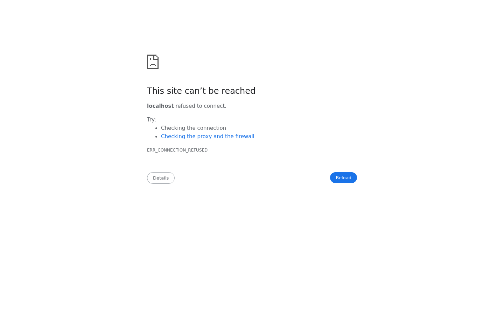
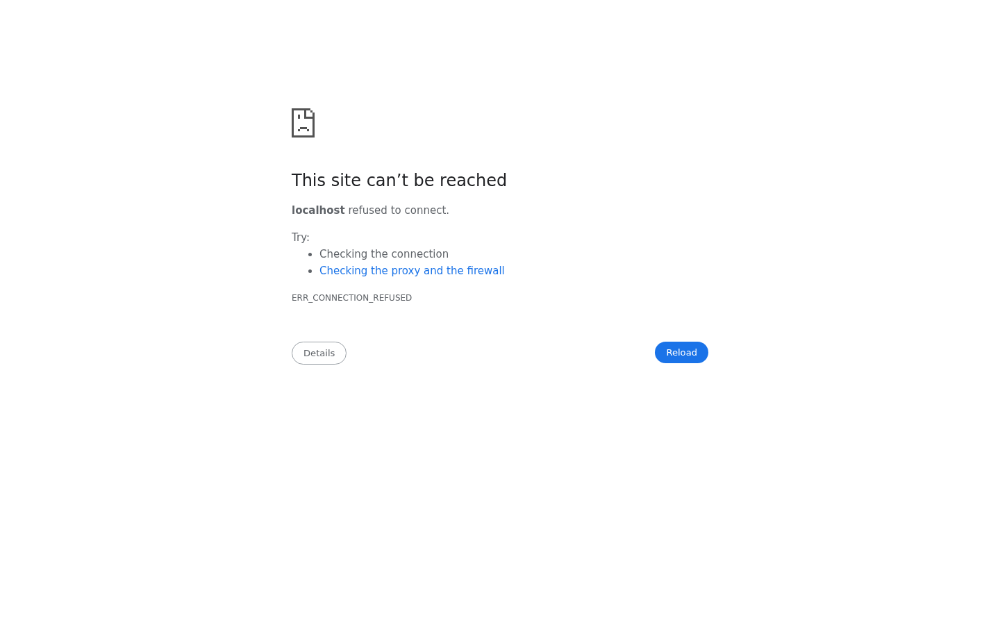

# DeepseekNova

> DeepSeek 原生 AI 编程 Agent — 终端优先，缓存命中 94%+

## 桌面前端预览

### 深色主题



### 浅色主题



## 特性

- 🧠 **自动记忆系统** — 四层架构（MemoryStore / SkillManager / UserProfile / RecallEngine），跨会话保持上下文
- ⚡ **6 个内置技能** — frontend-developer, coding-copilot, loop-engineering, first-principles, adversarial-review, dna-spec
- 🔒 **沙箱执行** — 安全隔离，Plan/Act/YOLO 三种模式可控
- 📊 **Token 追踪** — 缓存命中率、成本实时显示
- 📖 **项目后置产出** — Wiki 生成器、知识卡片、记忆蒸馏
- 🎨 **三栏桌面 UI** — 参考 Reasonix / Hermes WebUI 设计
- 🌗 **三套主题** — 浅色 / 深色 / 跟随系统（自动切换）
- 🔄 **双显示模式** — 图标模式 / 文字模式（全局切换）

## 主题系统

| 主题 | 说明 |
|------|------|
| ☀️ 浅色 | 白色背景，适合白天/明亮环境 |
| 🌙 深色 | 深色背景，护眼，适合夜间 |
| 🖥️ 跟随系统 | 自动检测系统主题，实时切换 |

主题选择持久化到 localStorage，跟随系统模式会监听 `prefers-color-scheme` 变化。

## 显示模式

所有 UI 元素支持两种显示模式，用户可通过顶栏 `Aa` 按钮或设置面板切换：

**图标模式**（默认）：
`● deepseek-chat | ✋ | 1,280↑ 856↓ | 🧠 342 | 💡 94% | Σ 25,329`

**文字模式**：
`● deepseek-chat | 模式: ACT | 输入 1,280 · 输出 856 | 推理 342 | 缓存 94% | 总计 25,329`

## 技术栈

| 层 | 技术 |
|---|---|
| 后端 | Rust + SQLite FTS5 |
| 前端 | React 18 + TypeScript + Vite |
| 桌面 | Tauri 2.0 |
| 状态 | Zustand |
| 主题 | CSS 变量 + data-theme 属性 |

## 桌面前端组件（20+）

| 组件 | 功能 |
|------|------|
| AppChrome | 三栏布局外壳 |
| TitleBar | 模型选择器、模式切换、Effort 切换、主题选择器 |
| Sidebar | 会话列表（日期分组）、搜索、技能库 |
| Transcript | 消息流（流式响应、自动滚动） |
| MessageItem | 用户/助手消息（头像 + Markdown） |
| ToolCard | 工具调用卡片（展开/折叠） |
| ReasoningCard | 推理卡片（金色主题，可折叠） |
| ApprovalCard | 危险命令审批 |
| Composer | 多行输入、Slash 命令、上下文指示器 |
| RightPanel | 4 标签页（上下文/工作区/记忆/TODO） |
| ContextPanel | 文件列表 + 已加载技能 |
| WorkspacePanel | 文件树浏览器 + Git 徽章 |
| MemoryPanel | 记忆搜索 + 列表 |
| TodoPanel | 任务进度追踪 |
| StatusBar | 模型/模式/Token/缓存/状态（图标⇄文字） |
| SettingsModal | 6 区域设置（通用/API/外观/技能/记忆/快捷键） |
| CommandPalette | Ctrl+P 命令面板 |
| Welcome | 空状态欢迎屏 |

## 快速开始

```bash
# 桌面前端
cd crates/deepseeknova-desktop/frontend
npm install && npm run dev

# 后端
cargo build --release
```

## 测试

382 个测试全通过，零 clippy 警告。

## License

MIT
