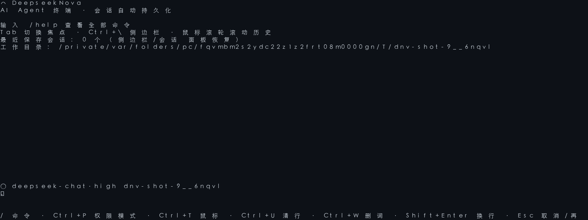
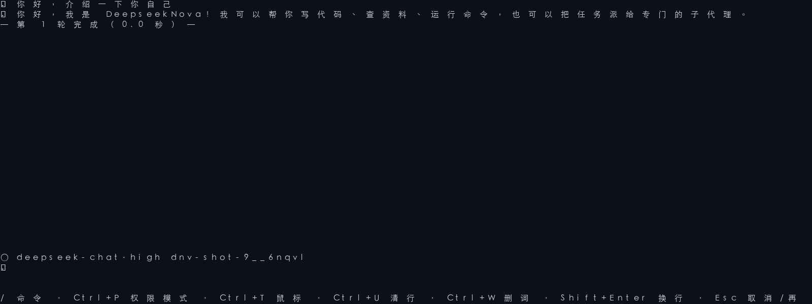

<div align="center">

# 🌟 DeepseekNova

### A DeepSeek-Native AI Coding Agent Framework

**21 Rust crates · 3 frontends (CLI / TUI / HTTP API)**

A Rust-from-scratch AI agent framework — not a wrapper. Built specifically for DeepSeek models.

[English](README_EN.md) | [中文](README.md)

</div>

---

<!-- CI Badges -->

<div align="center">

[](https://github.com/W117C/DeepseekNova/actions/workflows/ci.yml)
[](https://github.com/W117C/DeepseekNova/actions/workflows/security.yml)
[](https://github.com/W117C/DeepseekNova/actions/workflows/release.yml)
[](LICENSE-MIT)
[](https://www.rust-lang.org)

</div>

---

## 📸 Screenshots





> Generated by [scripts/tui-screenshot.py](scripts/tui-screenshot.py) from a real
> local TUI session (mock provider + PTY capture). You can also run
> `deepseeknova-cli chat --tui` yourself (requires `DEEPSEEKNOVA_API_KEY`).

---

## 🎯 Key Features

- **Deep reasoning + tool calling** — streaming reasoning output, 3-level reasoning effort (disabled / high / max; `low`/`medium` fold into high), 16 built-in tools
- **Daily experience** — `web_search` (DuckDuckGo / Tavily / Bing / SearXNG),
  `lsp_diagnostics` (auto-injected into tool results after write/edit/move),
  auto model+thinking routing (`[agent] auto_route = true`), and durable
  serve runs (`GET /v1/runs` / `POST /v1/runs/{id}/resume`)
- **Prefix-cache support** — DeepSeek V4 API-level automatic prefix caching,
  per-request cache-hit token tracking, session-level cross-turn hit-rate
  stats (live TUI status segment, threshold-colored), and budget control
- **Sandboxed execution** — macOS Seatbelt / Linux bubblewrap isolation;
  allow/ask/deny rule gating (`deny > ask > allow > default mode`) with session
  caching and optional rate limiting; a four-layer read-only shell command
  classifier (arbitrary-args / zero-args / exact form / subcommand flag
  allowlists) skips prompts, while ordinary shell composition (command
  substitution, chaining, redirection) is treated as non-read-only and flows
  through the permission gate (ask/allow rules can approve it); tool-level
  injection surfaces (`git -c`/`--config-env`, format-string injection,
  UNC/URL/SMB path forms) are hard-denied and cannot be overridden by rules
- **Multi-agent delegation** — delegate-based sub-agents (explorer / coder / tester / reviewer) with constrained tool sets, semaphore concurrency, and capped result summaries; isolated context, bounded recursion (`[delegate] allow_recursion = true`, depth capped by `max_depth`, default 3). Historical GOAP/Swarm/Federation experiments were removed in B0 (see DESIGN.md).
- **MCP protocol** — stdio + HTTP dual transport, auto-discovery
- **Project knowledge** — Wiki generation, knowledge cards, 4-layer memory distillation (ShortTerm · Task · Skill · UserProfile), file checkpoints; optional semantic retrieval (`[memory] embedder = "remote"` → hybrid `0.5*bm25 + 0.5*cosine` recall over memory and the code graph, fail-open to plain FTS); CLI memory user surface (`memory list / edit / delete / replay / search / stats / embed-backfill / cleanup`)
- **User-level hooks** — `[hooks]` external command hooks for five events (`tool_before` / `tool_after` / `session_start` / `session_end` / `failure`) chained with AND semantics; `tool_before` failures block the tool (fail-closed); zero process overhead when unconfigured
- **i18n bilingual UI** — TUI interface language via `[ui] lang = "en" | "zh"` or the `DEEPSEEKNOVA_LANG` env var (CLI takes precedence); ~190 user-facing strings moved into a vocabulary table with fail-safe English fallback
- **Worktree parallel sessions** — `deepseeknova-cli worktree new|list|switch|delete|clean` isolates parallel sessions via `git worktree`; each session writes its runtime state (graph/memory/audit/metrics) under its own workspace root, so sessions never interfere
- **Protocol execution engine (`[protocol]`)** — DNA five-phase gating (Understand→Plan→Execute→Verify→Distill) with built-in gates (plan-before-execute / verify-evidence / distill-on-complex / drift-detection), `hard|soft|off` levels, off by default with zero overhead; evidence-anchored verification (blocking on configured-but-unverified, `unverified` diagnose outcome); adversarial review sub-agent on trigger conditions
- **Skill self-evolution** — usage/success tracking (fitness), deprecate / merge / promote suggestions, deprecated filtering
- **Provider-neutral execution contract** — the built-in English default grounds work in observed state, requires understanding before edits, preserves unrelated changes, respects permission/security boundaries, and scales verification to risk; `[agent].system_prompt` fully replaces this default for the primary agent, while delegated agents always retain the shared baseline plus a replaceable role prompt
- **Dynamic prompt context** — graph retrieval guidance, repo maps, and failure-pattern feedback append after the default or an explicit primary prompt; planners, reviewers, compaction, and security investigation retain their specialized output contracts
- **Failure-pattern feedback** — failed sessions clustered into a redacted store, top-3 patterns auto-injected into the next session's first system prompt

## 🏗️ Architecture

```
Frontend    ratatui (TUI) · clap (CLI) · axum HTTP + SSE (API)
               │ WireEvent / SSE / CLI output
Runtime     Agent Loop · Coordinator · Plan-Mode Runner
            Event Bus · Permission Gate · Security Context
               │
Core        Runner Trait · Tool Trait · Registry · WireEvent
               │                    │
Provider    DeepSeek V4 Pro/Flash   Tools: File · Glob · Grep · Shell
            Streaming + Tools       WebFetch · Task · MCP Bridge · 16
```

## 📦 Crates

| Crate | Role |
|-------|------|
| `deepseeknova-core` | Core types: Runner / Tool trait, Registry, WireEvent |
| `deepseeknova-agent` | Agent loop, Coordinator, Plan-Mode Runner |
| `deepseeknova-provider` | DeepSeek / OpenAI-compatible / Anthropic streaming |
| `deepseeknova-tools` | 16 built-in tools + web search + LSP diagnostics + Context7 docs (delegate tool lives in the agent crate) |
| `deepseeknova-mcp` | MCP protocol client (stdio / HTTP) |
| `deepseeknova-metrics` | Session-level effectiveness metrics + JSON reports |
| `deepseeknova-graph` | Code graph engine (tree-sitter + SQLite FTS5 + PageRank + repo map) |
| `deepseeknova-sandbox` | Sandbox trait + macOS Seatbelt / Linux bubblewrap / Windows Job Object |
| `deepseeknova-permission` | Allow / Ask / Deny permission gate |
| `deepseeknova-security` | Path restrictions, resource limits, audit logging |
| `deepseeknova-scanner` | deepsec-style security scanning: rule matching + optional AI investigation (`scan` subcommand) |
| `deepseeknova-checkpoint` | Filesystem snapshots + transactional rollback |
| `deepseeknova-context` | Workspace indexing, project memory, session state |
| `deepseeknova-skills` | Markdown skill system (.claude/skills compatible) |
| `deepseeknova-store` | JSONL session persistence + rotation + compression |
| `deepseeknova-telemetry` | OpenTelemetry distributed tracing (OTLP) |
| `deepseeknova-runtime` | Composition root: registry + context + permission + security |
| `deepseeknova-config` | Layered TOML config (default → user → project → env → CLI) |
| `deepseeknova-cli` | CLI frontend: chat / plan / scan / serve / setup |
| `deepseeknova-tui` | ratatui terminal UI |
| `deepseeknova-serve` | axum HTTP server + SSE streaming |

## 🚀 Quick Start

### Installation

#### One-line install (recommended)

Downloads a prebuilt binary from GitHub Releases, verifies SHA256 checksums, and installs to `~/.local/bin`:

**macOS / Linux**

```bash
curl -fsSL https://raw.githubusercontent.com/W117C/DeepseekNova/main/install.sh | sh
```

**Windows (PowerShell)**

```powershell
irm https://raw.githubusercontent.com/W117C/DeepseekNova/main/install.ps1 | iex
```

- Supported platforms: macOS (Intel / Apple Silicon), Linux (x86_64 / ARM64), Windows (x86_64)
- Installs to `~/.local/bin` by default; override with the `INSTALL_DIR` env var
- Automatically downloads and verifies SHA256 checksums
- If no binary is published for your platform yet, the script will tell you

> 💡 The latest release is **v0.5.0**, whose assets cover all 5 platforms (macOS Intel / macOS ARM / Linux x86_64 / Linux ARM64 / Windows x86_64).

#### npm install

```bash
npm install -g deepseeknova
deepseeknova --help
```

The package's `postinstall` downloads the platform binary from GitHub Releases
and verifies its SHA-256; the `deepseeknova` command forwards to the native CLI.

Already have the Rust toolchain? You can also use [cargo-binstall](https://github.com/cargo-bins/cargo-binstall) to pull a prebuilt binary straight from GitHub Releases:

```bash
cargo binstall deepseeknova-cli
```

#### Build from source (alternative)

```bash
cargo build --release -p deepseeknova-cli
# Binary at target/release/deepseeknova-cli
```

### Configuration

**Fastest setup: run the configuration wizard** — it walks you through provider /
model / permission mode and writes the config file:

```bash
deepseeknova-cli setup           # writes ~/.deepseeknova/config.toml
export DEEPSEEKNOVA_API_KEY="sk-..." # then set your API key (the wizard prints the var name)
```

Or configure by hand. Prefer environment variables for API keys — never hardcode them:

```bash
export DEEPSEEKNOVA_API_KEY="your-api-key"
```

```toml
# ~/.deepseeknova/config.toml
default_model = "deepseek-chat"

[[providers]]
name = "deepseek"
kind = "openai-compatible"
base_url = "https://api.deepseek.com/v1"
api_key_env = "DEEPSEEKNOVA_API_KEY"  # reads from env, not hardcoded
model = "deepseek-chat"
```

> 💡 `DEEPSEEKNOVA_API_KEY` is the environment variable the code reads by
> default (when `api_key_env` is unset), with legacy `DEEPSEEK_API_KEY` as a
> fallback. The `api_key` field also works, but is **not recommended** — it
> risks being committed to version control. Prefer `api_key_env`. (Anthropic
> defaults to `ANTHROPIC_API_KEY`.)

> ⚠️ **Windows sandbox**: Windows uses the JobSandbox backend (Job Object):
> process-tree isolation plus active-process/memory limits. Job Objects do
> **not** restrict network or filesystem writes, so `allow_network=false`,
> read-only tiers, and `writable_paths` are not enforced on Windows. Configure
> `allowed_commands` and path policies carefully.

## 📊 CI

| Check | Workflow |
|-------|----------|
| cargo check (workspace) | CI |
| cargo clippy (-D warnings) | CI |
| cargo test (Ubuntu / macOS / Windows) | CI |
| cargo llvm-cov | CI |
| release build (3 platforms) | Release |
| cargo audit + cargo deny | Security |

## 🛠️ Tech Stack

| Layer | Technology |
|-------|-----------|
| Language | Rust (stable 1.97) |
| Backend | Rust + SQLite FTS5 + tokio + axum |
| Frontend | TUI (ratatui) · CLI (clap) · HTTP API (axum + SSE) |
| Tracing | OpenTelemetry (OTLP) |
| Tests | 1926 tests · cargo-llvm-cov · 3-platform CI |

## 📄 License

MIT OR Apache-2.0 — see [LICENSE-MIT](LICENSE-MIT) and [LICENSE-APACHE](LICENSE-APACHE).
